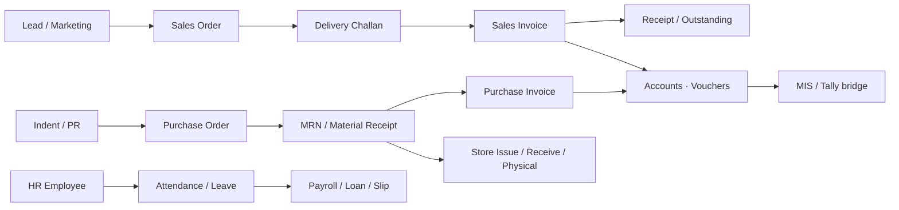

# KanhaERP — Final Portable Pack

**Version:** 2026-08-02 (field-parity + Extras deepen)  
**Stack:** FastAPI + SPA · SQLite (default) / Postgres (production)  
**Goal:** SBAC Digital ERP jaisa kaam · Kanha design · empty DB · white-label ready  

---

## 1) 5-minute run (Windows)

```
1. Python 3.11+ install (Add to PATH)
2. Double-click:  SETUP_PORTABLE.bat     ← pehli baar only
3. Double-click:  START_KANHA.bat
4. Browser:       http://127.0.0.1:8080
```

Ya terminal se:

```bat
cd backend
python -m venv .venv
.venv\Scripts\pip install -r requirements.txt
.venv\Scripts\uvicorn app.main:app --host 127.0.0.1 --port 8080 --reload
```

Band: terminal me `Ctrl+C`.

---

## 2) Demo logins (pehli baar seed)

| Role | Email | Password |
|------|--------|----------|
| **Admin** | `admin@kanhaerp.com` | `admin123` |
| Sales | `sales@kanhaerp.com` | `sales123` |
| Accounts | `accounts@kanhaerp.com` | `accounts123` |

**Owner Ultra Support** (login page bottom-right ◉):  
Demo pass → `KanhaCoreUltra1` (ya Admin password)  
Use: password reset / safe repair / Core Control.

> Production me `.env` me `ADMIN_PASSWORD` + `CORE_CONTROL_PASS` **zaroor badlo**.

---

## 3) Flow (business)



**Kanha routes (hash SPA):**

| Module | URL |
|--------|-----|
| Dashboard | `#/dashboard` |
| CRM / Party | `#/crm` |
| Inventory / Item | `#/inventory` |
| Sales (SO/Challan/Invoice) | `#/sales` |
| Purchase (PO/MRN/PI) | `#/purchase` |
| Store | `#/store` |
| Books / Accounts | `#/books` |
| HRMS | `#/hrms` |
| MIS | `#/mis` |
| Bridges / Tally | `#/bridges` |
| Extras (WA / OCR / Chase) | `#/extras` |
| WhatsApp OS | `#/whatsapp` |
| Go-live / Settings | `#/settings` · `#/compliance` |

Field docs: `docs/client-erp/MAP.md` + `docs/client-erp/forms/*.md`

---

## 4) White-label (kisi bhi company / naam pe)

### A) Sirf naam + brand (fast)

1. Copy `.env.example` → `.env`
2. Edit:

```env
APP_NAME=ClientERP
BRAND_TAGLINE=Your tagline
BRAND_SUPPORT_EMAIL=support@client.com
BRAND_PRIMARY=#1d4ed8
BRAND_ACCENT=#0f766e
BRAND_LOGO_URL=/assets/favicon.svg

COMPANY_NAME=Client Company Pvt Ltd
COMPANY_CODE=CLIENT
COMPANY_GSTIN=22AAAAA0000A1Z5

ADMIN_EMAIL=admin@client.com
ADMIN_PASSWORD=StrongPass123!
SECRET_KEY=paste-long-random-here
DEMO_MODE=false
CORS_ORIGINS=https://erp.client.com,http://127.0.0.1:8080
```

3. Restart `START_KANHA.bat`  
4. Fresh DB chahiye ho to `data/kanha_erp.db` delete karke dubara start (naya admin seed).

### B) UI se brand

Login Admin → Settings / Brand (`PUT /api/brand`) — logo, colors, name.

### C) Domain deploy (baad me kanhaone.com)

- Reverse proxy (nginx/Caddy) → `127.0.0.1:8080`
- `CORS_ORIGINS=https://kanhaone.com`
- Prefer Postgres: `DATABASE_URL=postgresql+psycopg2://...`
- Detail: `GO_LIVE.md`

**Rule:** Naam / company / colors / admin email `.env` (ya brand API) se change = poora product us client ka dikhega. Code fork zaroori nahi.

---

## 5) Env — kya badalne se kya LIVE hota hai

| `.env` keys | Effect |
|-------------|--------|
| `APP_NAME`, `BRAND_*`, `COMPANY_*` | White-label look + company |
| `ADMIN_EMAIL` / `ADMIN_PASSWORD` | First admin (empty DB seed) |
| `SECRET_KEY` | JWT security (**required** prod) |
| `DEMO_MODE=false` | Production mode; demo purge blocked |
| `DATABASE_URL` | SQLite default → Postgres production |
| `CORS_ORIGINS` | Browser allowlist for your domain |
| `WHATSAPP_TOKEN` + `WHATSAPP_PHONE_NUMBER_ID` | Meta Cloud **live** send |
| `WHATSAPP_VERIFY_TOKEN` | Meta webhook verify (`/api/meta/whatsapp/webhook`) |
| `RAZORPAY_KEY_ID` + `SECRET` | Live payments |
| `GSP_BASE_URL` + `GSP_API_KEY` | Live e-Invoice / e-Way |
| `LLM_API_KEY` + `LLM_PROVIDER` | Live AI chat |
| `SMTP_*` | Live email |
| `MAPS_API_KEY` | Live maps |

Keys **khali** = demo adapters (ERP flows phir bhi kaam karte hain).

Check: browser → `http://127.0.0.1:8080/api/health`

---

## 6) Important APIs (quick map)

| Area | Examples |
|------|----------|
| Auth | `POST /api/auth/login` |
| Brand | `GET /api/brand/public` · `PUT /api/brand` |
| Party / Item | CRM + inventory masters |
| Sales chain | SO → challan → invoice APIs under `/api/sales…` |
| Purchase | PO / MRN / PI under `/api/purchase…` + trading |
| Store | `/api/store/issues` · receives · physical · transfer |
| Books | `/api/books/ledgers` · `/api/books/vouchers` |
| HR | `/api/hrms/employees` · attendance · leaves · loans · payroll |
| Bridges | `/api/bridges` · `/api/bridges/tally/*` · `/api/bridges/erp/{target}/export` |
| Extras | `/api/extras/whatsapp-login` · `/ocr/parse` · `/store-slots` |
| Meta WA | `GET/POST /api/meta/whatsapp/webhook` (public) |
| Chase | `/api/advanced/chase/overdue` · send / send-all |

Full OpenAPI: `http://127.0.0.1:8080/docs`

---

## 7) Folder layout

```
KanhaERP-Final/
  START_HERE.txt          ← pehle yeh
  SETUP_PORTABLE.bat
  START_KANHA.bat
  README.md               ← yeh file
  GO_LIVE.md
  .env.example
  backend/                ← FastAPI
  frontend/               ← SPA
  data/                   ← SQLite DB (runtime)
  docs/
    ACTIVATION.md
    USER_GUIDE.md
    WHITE_LABEL.md
    client-erp/           ← SBAC field map + forms
```

---

## 8) Status (Aug 2026 deepen)

**Complete (field track):** Party · Item · SO · Challan · Sales Invoice · PO · MRN · PI · Store · Accounts · HR · MIS/Tally · Extras (Meta/OCR/WA Login/PWA).

**Optional later:** Play/App Store publish · cloud OCR vendor · SBAC leftover menus (Admin rights deep, Visit, Task, every MIS Panel variant) · kanhaone.com HTTPS deploy.

---

## 9) Support files

| File | Use |
|------|-----|
| `START_HERE.txt` | Non-technical start |
| `docs/ACTIVATION.md` | Activation / connection |
| `docs/USER_GUIDE.md` | Staff guide |
| `docs/WHITE_LABEL.md` | Rename for any company |
| `GO_LIVE.md` | Production checklist |
| `docs/client-erp/MAP.md` | Module map vs SBAC |

---

**Pack location (this save):** Pan Drive `G:\KanhaERP-Final`  
**Source of truth (dev):** `C:\Users\HP\Projects\kanha-erp`
